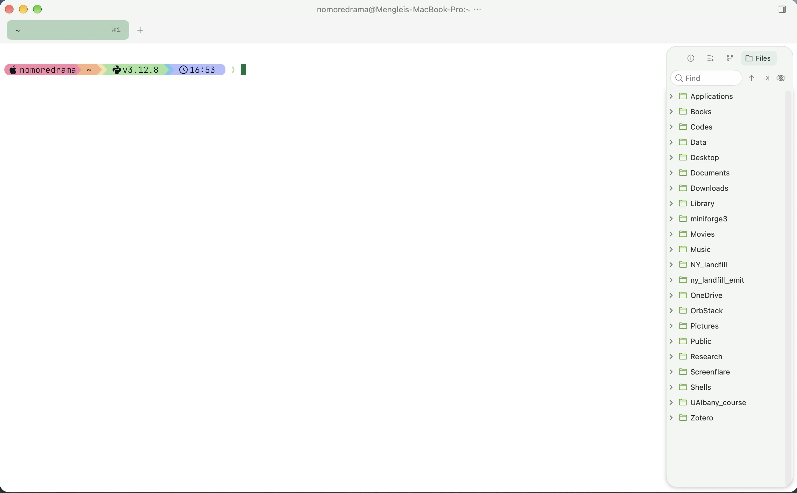
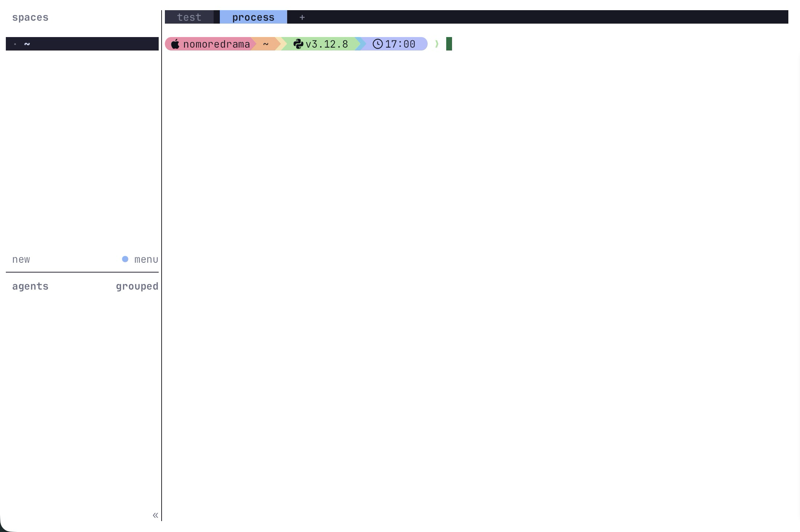
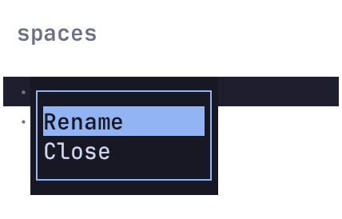
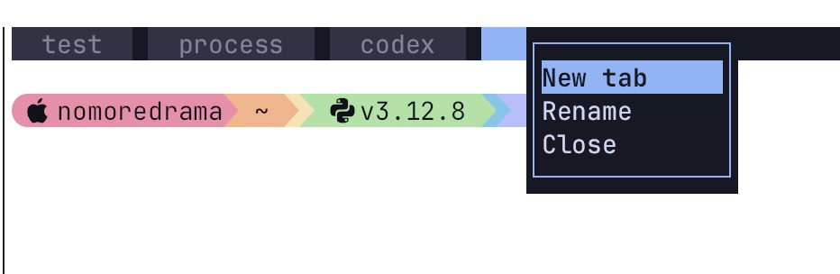
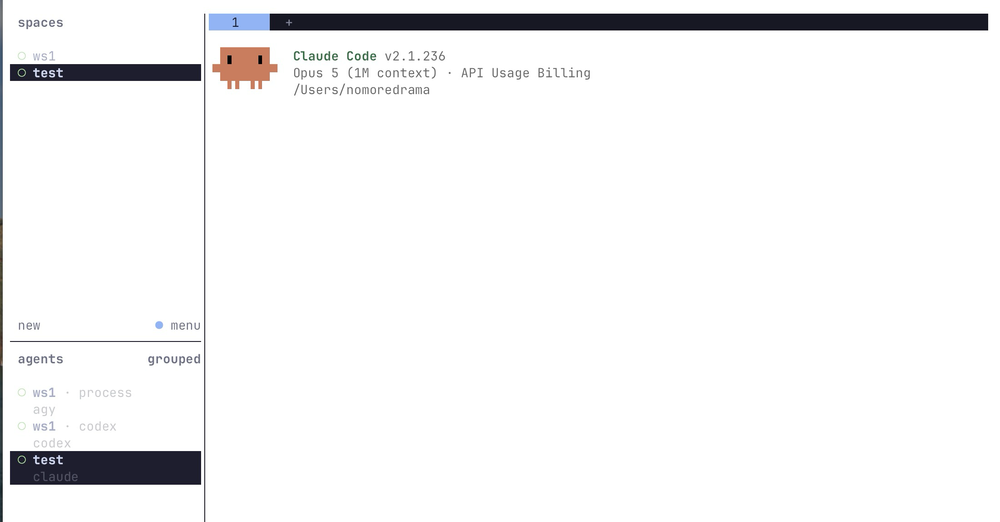

# otty + herdr

这个帖子我想介绍最近用的两个东西：otty，一款现代美观的终端；herdr 一个轻量的鼠标交互为主的终端复用器。

> 这篇是 [《ssh 和 tmux 捣鼓》](ssh%20and%20tmux.md) 的后续，记录我现在使用 otty + herdr 的终端工作流。文中截图均可点击放大。

<!-- more -->

## otty
otty 是我之前在刷推的时候，看到出品了 typora 的团队最新推出的一款终端，抱着试一试的心态，我就下载使用了一下，感觉这个终端的美观程度，功能丰富度和现代化程度都还算不错。现在也就作为我的主力终端使用了，不论是 iterm2 还是 ghostty 现在都不怎么用了。

<figure class="terminal-figure" markdown="1">

{ width="2602" height="1610" loading="lazy" decoding="async" }

<figcaption>图 1 · otty：April 主题与顶部标签栏</figcaption>
</figure>

这是我目前调整后的 otty 示意图，我改的设置不算多，选用了顶部标签栏的布局，主题则是选用了 April 这一看上去比较清新绿的主题。设置中的主题还是挺多样的，同时也提供倒入主题和自定义主题的功能。对这方面感兴趣可以自行尝试。

从我的使用角度出发，这款终端的主要两大特色就是：tab 快速切换 ｜ AI agent 的集成。

但是我不想过多说明这款终端，tab 切换是我认为这个终端原生就把多 tab 支持放在台面上了，很自然你就会多开好几个终端，用于多任务并行，这一功能其实也多少会和我后面要说的 herdr 重叠，但是我是结合起来用的。所谓 coding agent 集成其实也就是可以有一些实时的通知和提醒等，刚好结合 agent 在不同阶段的行为，例如需要用户进行 review 等。

## herdr
我记得先前写过一个帖子，主要记录了我使用 ssh 连接服务器的学习过程，以及为了持久化一些进程的运行，对 tmux 这个古典终端复用器学习的一些记录。但是时代在进步，tmux 的快捷键我已经忘的差不多了，每次打开使用都要复习一下，而且 tmux 这个工具的交互体验好像也不是那么适合现在，特别是多 agent 时代的背景下，命令行同时开 codex、claud code 或者 agy 都是常有的事情。

前段时间我用上了一个新的 终端复用器，它叫做 herdr，其实在用这个之前我还用了 zellij，感觉这是更现代版本的 tmux，但是需要记住一套新的快捷键，学习成本还是不低，同时对于我的使用场景来说，我总会遇到卡顿和窗口调节存在问题的情况，特别是在 ssh 连接到学校的服务器上时。最后，我用起了 herdr，感受到这个工具使用上的直观和简单，几乎没有学习成本，开箱即用，非常值得推荐。

herdr 的安装很简单，直接看官网的下载说明就行，实在不行找个 coding agent 也一下子就装好了。安装完毕后 herdr 就能直接打开了。以下就是我 herdr 打开后的页面

<figure class="terminal-figure" markdown="1">

{ width="2198" height="1464" loading="lazy" decoding="async" }

<figcaption>图 2 · herdr：左侧管理工作区与 agent，顶部切换 tab</figcaption>
</figure>

herdr 的使用很简单，一切都靠鼠标就行。herdr 的页面布局也很简单，1+1+1 的布局，左侧三部分是 workspace 的管理，点击 new 就能新建 一个space，点击menu 就是一些设置和退出 herdr 的 detach 按钮。

workspace 我认为是 终端复用的第一个层级，通过创建不同的 workspace 来管理不同类型的项目或者任务。通过右键点击就能快速更改 workspace的名称，或者关闭这个workspace

<figure class="terminal-figure terminal-figure--compact" markdown="1">

{ width="428" height="274" loading="lazy" decoding="async" }

<figcaption>图 3 · 右键管理 workspace：重命名或关闭</figcaption>
</figure>

而 herdr 的第二个层级则是 workspace 下的 tab，这里的使用逻辑就让我觉得和 otty 的 tab 比较类似了。点击添加新的 tab，不同的 tab 用于呈现不同的信息或者执行不同的任务。同样也可以右键进行改名和关闭。

<figure class="terminal-figure terminal-figure--medium" markdown="1">

{ width="932" height="304" loading="lazy" decoding="async" }

<figcaption>图 4 · 右键管理 tab：新建、重命名或关闭</figcaption>
</figure>

而 herdr 更新的地方则在于对 agent 的集成，左侧下方的 pane 就是当前 herdr 会话中存在的不同的 agent 的统一管理视图了，不管是在哪一个 workspace，在哪一个 tab 中，只要是一个安装过配置的 agent，都能直接显示和切换过去。
<figure class="terminal-figure" markdown="1">

{ width="2198" height="1148" loading="lazy" decoding="async" }

<figcaption>图 5 · 在 agents 列表中跨 workspace 和 tab 切换</figcaption>
</figure>

如同所示，我现在分别有 ws1 和 test 两个 workspace，在 ws1 中的两个不同 tab 中，分别开启了 agy 和 codex 两个 agent，而在 test 中我也有一个 tab 打开了一个 claude code，我只需要快速点击就能切换到对应的 agent。

## 两者的重叠和结合
我现在的主要使用工作流就是创建若干个 otty 的 tab，以此区分是当前机器上的终端工作，还是 ssh 到服务器上的终端工作。

对于每一个 otty 的 tab，我则开始使用 herdr 进行终端复用管理。其实翻来覆去有人可能会觉得 不就是多开终端窗口吗？其实我的理解就是终端复用，一方面会让你更有组织和条理的面对电脑上不同类型的工作流，另一方面则是多了 herdr 这一层以后，所有的工作都可以即插即用，之前弄到一半的任务，直接 detach 掉，第二天再用 herdr 打开，所有布局和打开过的东西全部都在。这对我使用 ssh 完成任务来说是最重要的东西，放在背后要跑很久的东西也不用担心断开 ssh 连接就会停止。

以上就是我目前的终端和复用器更新后的工作流。

